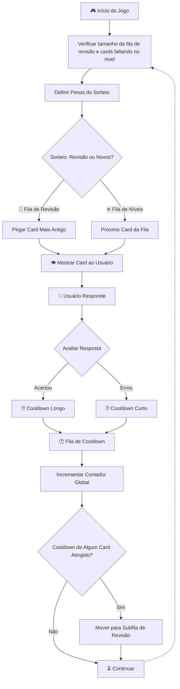

# 🎯 Projeto: MicroLearning de Biodiversidade

## 1. O que é?

Uma plataforma de microlearning gamificada para aprender sobre biodiversidade local através de flashcards inteligentes. O sistema utiliza repetição espaçada para otimizar a retenção do conhecimento, organizando o aprendizado em sessões curtas e envolventes.

### 🎮 Como Funciona?

Você estuda espécies de animais através de **flashcards organizados por níveis de dificuldade**:

- **🟢 Fáceis**: Espécies comuns, perguntadas em níveis taxonômicos altos (ex.: ordem, família)
- **🟡 Médios**: Espécies comuns, mas em níveis taxonômicos mais específicos (ex.: gênero, espécie)
- **🟠 Médios Avançados**: Mistura de espécies comuns (gênero/espécie) e espécies incomuns em níveis mais altos (ordem/família)
- **🔴 Difíceis**: Espécies incomuns, perguntadas em nível de gênero ou espécie

O sistema **automaticamente decide** quando mostrar cards novos ou revisar cards antigos, baseado no seu desempenho e em um algoritmo inteligente de repetição espaçada.

### 📱 Tipos de Deck Disponíveis

**🌍 Decks Automáticos**: Gerados automaticamente com espécies da sua região geográfica. Basta selecionar uma área no mapa e o sistema cria um deck personalizado com animais realmente presentes na sua localidade.

**📚 Decks Curados** (em breve): Pacotes educacionais especializados com conteúdo mais rico, incluindo múltiplas imagens, descrições detalhadas, contexto ecológico e dicas de identificação.

---

## 2. Sistema de Repetição Espaçada 🧠

### Como o Sistema Decide o Que Mostrar?

O algoritmo utiliza **três filas inteligentes** que trabalham juntas:

#### ✳️ **Fila de Níveis (Cards Novos)**

- Contém cards que você ainda não viu
- Organizados por dificuldade (fácil → médio → avançado)
- Cards saem desta fila após primeira visualização

#### ⏱️ **Fila de Cooldown (Aguardando)**

- Cards que você já estudou, mas ainda não estão prontos para revisão
- Cada card tem um "tempo de espera" baseado na sua performance:
  - ✅ **Acertou fácil?** → Demora mais para reaparecer
  - ❌ **Errou ou teve dificuldade?** → Volta mais rápido

#### 🔄 **Fila de Revisão (Prontos para Revisar)**

- Cards liberados e prontos para nova rodada de estudo
- Organizados por ordem de prioridade (mais antigos primeiro)

### 🎲 Sorteio Inteligente

A cada jogada, o sistema **balanceia automaticamente** entre:

- Mostrar **cards novos** (aprender coisas novas)
- Fazer **revisão** de cards antigos (consolidar conhecimento)

O peso da decisão varia conforme quantos cards estão prontos para revisão - se há muitos, o sistema prioriza revisão; se há poucos, foca em conteúdo novo.



---

## 3. Conceitos Chave

### 🎯 **Microlearning**

Sessões curtas de 5-15 minutos para maximizar retenção sem fadiga cognitiva.

### 🔄 **Repetição Espaçada Gamificada**

Sistema que balanceia automaticamente novos conteúdos com revisões, baseado em performance individual e contador global de jogadas.

### 📈 **Progressão por Níveis**

Organização natural do aprendizado: espécies comuns → incomuns → raras, respeitando a curva de dificuldade natural.

### 🌍 **Foco Geográfico**

Aprendizado contextualizado com espécies realmente presentes na sua região, aumentando relevância e aplicabilidade prática.

### 🎓 **Tipos de Deck**

**Decks Automáticos (GBIF)**: Gerados dinamicamente com base em localização geográfica, focados em cobertura ampla de espécies locais.

**Decks Curados**: Conteúdo educacional especializado com:

- Múltiplas imagens por espécie
- Descrições detalhadas em markdown
- Contexto ecológico e comportamental
- Informações sobre habitat e conservação
- Dicas de identificação específicas

---

## 4. Para Desenvolvedores 🛠️

### Stack Tecnológica

- **Frontend**: Nuxt 4 (Vue 3 + Composition API)
- **Estilo**: Tailwind CSS (via `app.css`)
- **Armazenamento Local**: Pinia stores conectado ao IndexedDB para persistir decks e progresso
- **Fonte de Dados**:
  - API do GBIF para espécies locais (decks automáticos)
  - Database para decks curados, com CMS para editores (planejado)
- **Gerenciador de Pacotes Recomendado**: Bun

### Funcionalidades Implementadas

- ✅ **Geração de Decks Automáticos**: Página `/decks/novo-inat` com seleção geográfica via mapa (API GBIF)
- ✅ **Listagem de Decks**: Página `/decks` para gerenciar decks criados
- ✅ **Sistema de Filas**: Implementação das três filas de repetição espaçada
- ✅ **Contador Global**: Rastreamento de jogadas para controle de cooldown
- ✅ **Classificação por Níveis**: Organização automática das espécies por dificuldade
- ✅ **Persistência Robusta**: Armazenamento via Pinia + IndexedDB

### 🚧 Em Desenvolvimento

- 🔄 **Interface de Estudo**: Sistema de flashcards gamificado
- 🔄 **Métricas de Performance**: Estatísticas de acertos e progresso
- 🔄 **Decks Curados**: Pacotes educacionais com conteúdo detalhado e contexto ecológico
- 🔄 **Exportação/Importação**: Backup e transferência de dados

### Estrutura de Arquivos

```
app/
├── assets/
│   ├── app.css         # Estilos globais (Tailwind)
│   └── crosshair.svg   # Ícone para seleção no mapa
│
├── components/
│   ├── deck/
│   │   └── List.vue    # Listagem dos decks salvos
│   │   └── CachedImage.vue # Exibição de imagens comprimidas em cache local (indexedDB via localForage)
│
│   ├── gerador/
│   │   └── Mapa.vue    # Mapa para seleção geográfica (API GBIF)
│   └── menus/
│       ├── Dock.vue    # Menu de navegação inferior
│       └── Navbar.vue  # Barra de navegação superior
│
├── pages/
│   ├── index.vue       # Página inicial
│   └── decks/
│       ├── index.vue   # Lista de decks disponíveis
│       └── novo-inat.vue # Criação de deck automático via GBIF
│
├── plugins/
│   └── deck-db.ts      # Plugin para persistência de decks
│
├── stores/
│   └── decks.ts        # Store Pinia para gerenciamento de decks e progresso
│
└── utils/
    └── apiEspecies.ts # Utilitários para APIs externas (GBIF, iNaturalist)
```

### Como Executar o Projeto

1. **Instale as dependências**:

   ```bash
   bun install
   ```

2. **Inicie o servidor de desenvolvimento**:

   ```bash
   bun run dev
   ```

3. Abra o navegador em [http://localhost:3000](http://localhost:3000)

---

_Este projeto está em desenvolvimento ativo. Contribuições e sugestões são bem-vindas!_ 🚀
