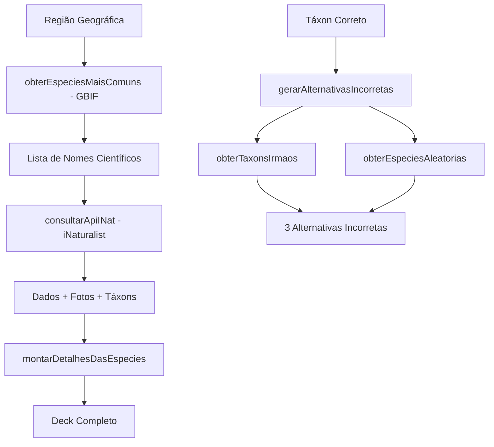

# API Utils Module

Este módulo contém todas as funções relacionadas à consulta de APIs externas (GBIF, iNaturalist) e processamento de dados de espécies, organizadas de forma modular para facilitar manutenção e reutilização.

## 📁 Estrutura

```
api/
├── README.md           # Esta documentação
├── index.ts           # Exportações centralizadas
├── types.ts           # Tipos TypeScript compartilhados
├── inaturalist.ts     # Funções do iNaturalist API
├── gbif.ts            # Funções do GBIF API
├── alternativas.ts    # Geração de alternativas incorretas (com cache Redis)
└── deck-builder.ts    # Construção de decks automáticos com Cards
```

## 🔧 Módulos

### `types.ts`
Contém todas as interfaces TypeScript usadas pelos outros módulos:
- `INatTaxon` - Dados de um táxon do iNaturalist
- `MediaEspecie` - Informações de mídia (fotos)
- `EspecieComDados` - Espécie com dados completos para o deck
- `Especie` - Tipo simplificado para alternativas de jogo

### `inaturalist.ts`
Funções para interação com a API do iNaturalist:
- `consultarApiINat()` - Busca dados completos de uma espécie
- `obterTaxonsIrmaos()` - Encontra táxons no mesmo nível taxonômico
- `obterEspeciesAleatorias()` - Busca espécies aleatórias para distratores

### `gbif.ts`
Funções para interação com a API do GBIF:
- `obterEspeciesMaisComuns()` - Lista espécies mais registradas em uma região

### `alternativas.ts`
Lógica para geração de alternativas incorretas em flashcards com cache Redis:
- `gerarAlternativasIncorretas()` - Cria 3 distratores, primeiro buscando no Redis, senão gera automaticamente
- Cache Redis: `especies:alternativas:{inatID}` com hash contendo alternativas 1, 2, 3

### `deck-builder.ts`
Funções de alto nível para construção de decks:
- `montarCardsComAlternativas()` - **NOVA** - Processa espécies e cria Cards com alternativas prontas
- `criarDeckAutomatico()` - **REFATORADA** - Pipeline completo retornando Cards prontos para `addCards()`
- `montarDetalhesDasEspecies()` - Função de compatibilidade (interface antiga)

## 📊 Fluxo de Dados



## 🚀 Como Usar

### Importação Simples
```typescript
// Importe do index principal
import {
  criarDeckAutomatico,
  montarCardsComAlternativas,
  gerarAlternativasIncorretas,
  consultarApiINat
} from '~/utils/api';
```

### Importação Específica
```typescript
// Importe de módulos específicos
import { obterTaxonsIrmaos } from '~/utils/api/inaturalist';
import { obterEspeciesMaisComuns } from '~/utils/api/gbif';
```

### Exemplo Prático

#### 1. Criar Deck Automático com Cards
```typescript
const geometriaCirculo = {
  type: "Feature",
  geometry: {
    type: "Polygon",
    coordinates: [[[-48, -16], [-47, -16], [-47, -15], [-48, -15], [-48, -16]]]
  }
};

const deck = await criarDeckAutomatico(geometriaCirculo, 20);
console.log(`Deck criado com ${deck.totalCards} cards`);

// Os cards já vêm com alternativas prontas:
const deckStore = useDeckStore('meu-deck');
await deckStore.addCards(deck.cards); // ✅ Cards prontos para uso
```

#### 2. Gerar Alternativas para Flashcard
```typescript
// Primeiro, obter o táxon correto
const resultado = await consultarApiINat("Panthera onca");
if (resultado) {
  // Gerar alternativas incorretas
  const alternativas = await gerarAlternativasIncorretas(
    resultado.taxon,
    resultado.nomePopularPt,
    "species"
  );

  console.log("Alternativas incorretas:", alternativas);
  // Pode retornar:
  // [
  //   { nome_cientifico: "Felis onca", nome_popular: "Leopardo" },
  //   { nome_cientifico: "Puma concolor", nome_popular: "Onça-parda" },
  //   { nome_cientifico: "Lynx rufus", nome_popular: "Onça-pintada" }
  // ]
}
```

## ⚡ Otimizações Implementadas

### Cache Redis para Alternativas
- **NOVA**: Busca alternativas pré-curadas no Redis antes de gerar automaticamente
- Chave: `especies:alternativas:{inatID}` com hash `1:nome_popular`, `1:nome_cientifico`, etc.
- Reduz tempo de processamento e melhora qualidade das alternativas

### Redução de Chamadas API
- `consultarApiINat()` retorna o objeto `INatTaxon` completo, eliminando necessidade de chamadas adicionais
- Cache local de dados de espécies durante processamento em lote

### Estratégias Inteligentes para Alternativas
1. **Cache Redis prioritário**: Usa alternativas pré-curadas quando disponíveis
2. **Nome popular correto + científico errado**: Confunde usuário testando reconhecimento científico
3. **Epiteto específico correto + gênero errado**: Testa conhecimento de taxonomia
4. **Grupos irmãos**: Alternativas botanicamente/zoologicamente relacionadas

### Cards com Níveis Automáticos
- **NOVA**: Determina nível de dificuldade baseado no `max_id_level` do Redis
- `species` → `facil`, `genus` → `medio`, `family` → `dificil`, outros → `desafio`
- Cooldown inicial baseado no nível de dificuldade

### Fallbacks Robustos
- Se não conseguir alternativas específicas, completa com espécies aleatórias
- Sempre garante exatamente 3 alternativas incorretas
- Evita duplicatas usando `Set` interno


## 📝 Contribuição

Ao adicionar novas funcionalidades:

1. **Coloque a função no módulo apropriado** (inaturalist.ts, gbif.ts, etc.)
2. **Adicione tipos em types.ts** se necessário
3. **Exporte em index.ts** para disponibilizar publicamente
4. **Adicione testes** em `/test/unit/`
5. **Documente aqui** com exemplos de uso

## 🚨 Rate Limiting

As APIs têm limites de requisições:
- **iNaturalist**: ~1 req/seg


Para uso em produção, considere implementar:
- Cache Redis para respostas das APIs externas
- Rate limiting client-side
- Autenticação para limites maiores
- **NOVO**: Popular o Redis com alternativas pré-curadas para species comuns
